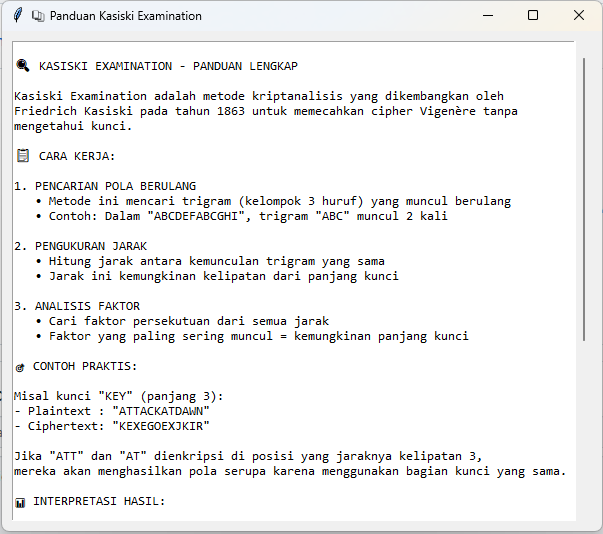

# 🔐 Simulasi Vigenère Cipher dengan Teknik Kasiski
Aplikasi ini adalah alat bantu interaktif berbasis GUI (Tkinter) yang digunakan untuk mengenkripsi dan mendekripsi pesan menggunakan **Vigenère Cipher** serta menganalisis keamanan cipher dengan **Teknik Kasiski**. Sistem ini menyediakan simulasi lengkap untuk memahami kriptanalisis klasik dan kelemahan cipher polyalphabetic.

---
## 👥 Anggota Kelompok 6
| Nama                     | GitHub                                      |
|--------------------------|---------------------------------------------|
| Agyl Wendi Pratama       | [likeazwee](https://github.com/likeazwee)  |
| Habib Al-Qodri           | [HabibAlQodri](https://github.com/HabibAlQodri) |
| Muhammad Ryan Al-Habsy   | [Starcres](https://github.com/Starcres)    |
| Sidik Bagus Firmansyah   | [Sidiqkun](https://github.com/Sidiqkun)    |
| Yohanes Adi Prasetya     | [Feuriee](https://github.com/Feuriee)      |

---
## 🧠 Algoritma dan Proses Enkripsi/Dekripsi

### Vigenère Cipher
1. Pengguna memasukkan **plaintext** dan **kunci** enkripsi.
2. Kunci diperpanjang atau dipotong sesuai panjang plaintext.
3. Setiap karakter plaintext digeser sesuai nilai karakter kunci yang bersesuaian.
4. Hasil enkripsi berupa **ciphertext** yang lebih aman dari Caesar Cipher.

### Teknik Kasiski untuk Kriptanalisis
1. Cari pola berulang dalam ciphertext (minimum 3 karakter).
2. Hitung jarak antar kemunculan pola yang sama.
3. Tentukan **Greatest Common Divisor (GCD)** dari semua jarak.
4. Perkirakan panjang kunci berdasarkan faktor-faktor GCD.
5. Lakukan **frequency analysis** untuk setiap posisi kunci.
6. Rekonstruksi kunci dan dekripsi pesan.

---
## 🖥️ Tampilan Antarmuka
### 🔐 Halaman Enkripsi Vigenère

### 🔍 Halaman Analisis Kasiski

### 📊 Visualisasi Frequency Analysis

### ❔Halaman Panduan

---
### 📈 Hasil Rekonstruksi Kunci

---
## ⚙️ Cara Menjalankan Aplikasi
### 1. Clone Repository
```bash
git clone https://github.com/Feuriee/Vigenere-Cipher-Kasiski.git
cd Vigenere-Cipher-Simulator
```
### 2. Install Dependencies (opsional)
```bash
pip install tkinter matplotlib numpy collections
```
### 3. Jalankan Aplikasi
```bash
python main.py
```
## ✅ Fitur Lengkap
- **Enkripsi Vigenère**: Input plaintext dan kunci untuk menghasilkan ciphertext
- **Dekripsi Vigenère**: Dekripsi ciphertext dengan kunci yang diketahui
- **Teknik Kasiski**: Analisis otomatis untuk memecahkan cipher
- **Pattern Detection**: Pencarian pola berulang dalam ciphertext
- **Distance Calculation**: Perhitungan jarak antar pola identik
- **GCD Analysis**: Penentuan kemungkinan panjang kunci
- **Frequency Analysis**: Analisis frekuensi huruf untuk setiap posisi kunci
- **Key Reconstruction**: Rekonstruksi kunci berdasarkan analisis statistik
- **Visualisasi Grafik**: Tampilan visual untuk frequency analysis
- **Export Results**: Simpan hasil analisis dalam format teks
- **Step-by-Step Guide**: Panduan langkah demi langkah proses kriptanalisis
- **Educational Mode**: Mode pembelajaran dengan penjelasan detail setiap tahap
- **GUI Interaktif**: Antarmuka berbasis Tkinter yang user-friendly
- **Real-time Analysis**: Analisis cipher secara real-time
- **Multiple Cipher Support**: Dukungan untuk berbagai variasi Vigenère
---
